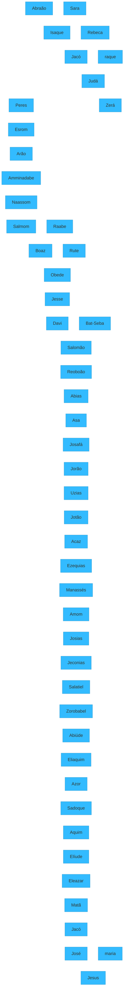

```mermaid
%%{init: {"theme": "base", "themeVariables": {
  "primaryColor": "#33bbff",
  "fontSize": "20px",
  "fontWeight": "bold",
  "lineColor": "#ffffff"
}}}%%
graph TD
  abraao[Abraão] --> isaque[Isaque]
  sara[Sara] --> isaque

  isaque --> jaco[Jacó]
  rebeca[Rebeca] --> jaco

  jaco --> juda[Judá]
  raque --> juda
  
  juda --> peres[Peres]
  juda --> zera[Zerá]
  
  peres --> esrom[Esrom]
  
  esrom --> arao[Arão]
  
  arao --> amminadabe[Amminadabe]
  
  amminadabe --> naassom[Naassom]
  
  naassom --> salmom[Salmom]
  
  salmom --> boaz[Boaz]
  raabe[Raabe] --> boaz

  boaz --> obed[Obede]
  ruth[Rute] --> obed
  
  obed --> jesse[Jesse]
  
  jesse --> davi[Davi]
  
  davi --> salomao[Salomão]
  betseba[Bat-Seba] --> salomao

  salomao --> roboao[Reoboão]
  
  roboao --> abias[Abias]
  abias --> asa[Asa]
  asa --> josafa[Josafá]
  josafa --> jorao[Jorão]
  jorao[Jorão] --> uzias[Uzias]
  uzias --> jotao[Jotão]
  jotao --> acaz[Acaz]
  acaz --> ezequias[Ezequias]
  ezequias --> manasses[Manassés]
  manasses --> amom[Amom]
  amom --> josias[Josias]
  josias --> jeconias[Jeconias]
  jeconias --> salatiel[Salatiel]
  salatiel --> zorobabel[Zorobabel]
  zorobabel --> abiude[Abiúde]
  abiude --> eliaquim[Eliaquim]
  eliaquim --> azor[Azor]
  azor --> sadoque[Sadoque]
  sadoque--> aquim[Aquim]
  aquim--> eliude[Elíude]
  eliude--> eleazar[Eleazar]
  eleazar--> matã[Matã]
  matã--> jaco2[Jacó]
  jaco2--> jose2[José]
  jose2--> jesus[Jesus]
  maria--> jesus
```
