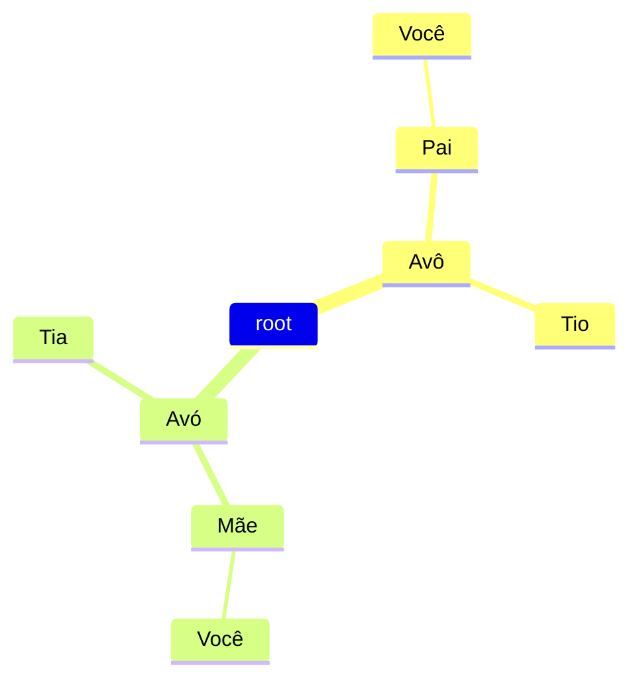
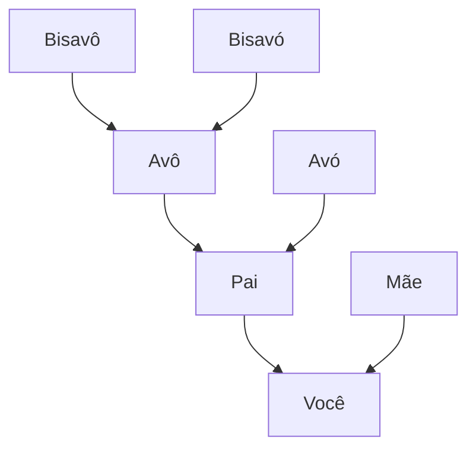

```mermaid
mindmap
  root
    Avô
      Pai
        Você
      Tio
    Avó
      Mãe
        Você
      Tia
```

```mermaid
graph TD
  A[Bisavô] --> B[Avô]
  C[Bisavó] --> B
  B --> D[Pai]
  E[Avó] --> D
  D --> G[Você]
  F[Mãe] --> G
```
